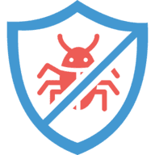

<a name="readme-top"></a>
[](https://github.com/tahsingokalp/lett-tracker/actions)
[](https://sonarcloud.io/summary/new_code?id=TahsinGokalp_lett-tracker)
[](https://sonarcloud.io/summary/new_code?id=TahsinGokalp_lett-tracker)
[](https://sonarcloud.io/summary/new_code?id=TahsinGokalp_lett-tracker)
[](https://sonarcloud.io/summary/new_code?id=TahsinGokalp_lett-tracker)
[](https://sonarcloud.io/summary/new_code?id=TahsinGokalp_lett-tracker)
[](https://sonarcloud.io/summary/new_code?id=TahsinGokalp_lett-tracker)

<br />
<div align="center">
  <a href="https://github.com/tahsingokalp/lett-tracker">
    
  </a>

<h3 align="center">Lett Tracker</h3>

  <p align="center">
    Let is a simple to use and implement error tracker built for the Laravel framework.
    <br />
    <br />
    <a href="https://github.com/tahsingokalp/lett-tracker/issues">Report Bug</a>
    ·
    <a href="https://github.com/tahsingokalp/lett-tracker/issues">Request Feature</a>
  </p>
</div>


<!-- TABLE OF CONTENTS -->
<details>
  <summary>Table of Contents</summary>
  <ol>
    <li>
      <a href="#about-the-project">About The Project</a>
      <ul>
        <li><a href="#built-with">Built With</a></li>
      </ul>
    </li>
    <li>
      <a href="#getting-started">Getting Started</a>
      <ul>
        <li><a href="#prerequisites">Prerequisites</a></li>
        <li><a href="#manual">Installation (Manual)</a></li>
        <li><a href="#docker">Installation (Docker)</a></li>
      </ul>
    </li>
    <li><a href="#roadmap">Roadmap</a></li>
    <li><a href="#contributing">Contributing</a></li>
    <li><a href="#license">License</a></li>
    <li><a href="#contact">Contact</a></li>
    <li><a href="#acknowledgments">Acknowledgments</a></li>
  </ol>
</details>

<!-- ABOUT THE PROJECT -->
## About The Project

[![Lett Screen Shot][product-screenshot]](https://github.com/tahsingokalp/lett-tracker)

Lett Tracker is a powerful error tracking application built specifically for the Laravel framework. With Lett Tracker, you can easily track errors and issues in your application, ensuring that your users have the best experience possible.

Lett Tracker includes a range of features to help you manage errors and issues in your application, including:

* Error tracking: Lett Tracker tracks all of your errors and provides detailed information about each one, including the error message, stack trace, and more.
* Issue management: Lett Tracker allows you to easily manage your issues and track their status, from open to closed.
* Customizable notifications: Lett Tracker lets you customize your notifications so that you only receive alerts for the errors and issues that matter most to you.
* Intuitive interface: Lett Tracker features an intuitive and easy-to-use interface that makes it simple to navigate and manage your errors and issues.

Lett Tracker also integrates with the Lett package, which is an external package that can be installed in your Laravel application to help automate error detection and reporting. With the Lett package, you can easily collect and analyze errors in your application, making it easier to identify and fix issues before they impact your users.


Overall, Lett Tracker is an essential tool for any Laravel developer who wants to ensure that their application is running smoothly and error-free. With its powerful features and easy-to-use interface, Lett Tracker makes it simple to manage errors and issues in your application, so that you can focus on building great software.

<p align="right">(<a href="#readme-top">back to top</a>)</p>

### Built With

* [![PHP][PHP]][PHP-url]
* [![Laravel][Laravel.com]][Laravel-url]
* [![Vue][Vue.js]][Vue-url]
* [![Tailwind][Tailwind]][Tailwind-url]

<p align="right">(<a href="#readme-top">back to top</a>)</p>

<!-- GETTING STARTED -->
## Getting Started

To get a your copy up and running follow these simple steps.

### Prerequisites

* PHP 8.1 or higher
* Git
* Composer
* MySQL (>=5.7) or PostgreSQL (>=9.4)

### Installation

#### Manual

1. Clone the repo
   ```sh
   git clone --branch master https://github.com/tahsingokalp/lett-tracker.git
   ```
2. Install Composer packages
   ```sh
   composer install
3. Install NPM packages
   ```sh
   npm install
   ```
4. Compile assets
   ```sh
   npm run build
   ```
5. Configure your settings in the `.env` file
6. Migrate and seed database
   ```sh
   php artisan migrate --seed
   ```

<p align="right">(<a href="#readme-top">back to top</a>)</p>

#### Docker
TODO
Go into the docker folder and run:
`docker-compose up -d --build`

Set your database .env variables:
```
DB_CONNECTION=mysql
DB_HOST=db
DB_PORT=3306
DB_DATABASE=larbug
DB_USERNAME=root
DB_PASSWORD=secret
```

Running artisan commands:

`docker exec -it larabug php artisan <command>`

The Application will be running on `localhost:1337` and PhpMyAdmin is running on `localhost:8010`

<p align="right">(<a href="#readme-top">back to top</a>)</p>

<!-- ROADMAP -->
## Roadmap

- [ ] Create readme
- [ ] Fix search problem
- [ ] Add docker
- [ ] Write unit tests
- [ ] Write integration tests
- [ ] Multi-language Support
    - [ ] English
    - [ ] Turkish
- [ ] Add permissions
- [ ] Add user project permissions
- [ ] Add comments to issues

See the [open issues](https://github.com/tahsingokalp/lett-tracker/issues) for a full list of proposed features (and known issues).

<p align="right">(<a href="#readme-top">back to top</a>)</p>

<!-- CONTRIBUTING -->
## Contributing

Contributions are what make the open source community such an amazing place to learn, inspire, and create. Any contributions you make are **greatly appreciated**.

If you have a suggestion that would make this better, please fork the repo and create a pull request. You can also simply open an issue with the tag "enhancement".
Don't forget to give the project a star! Thanks again!

1. Fork the Project
2. Create your Feature Branch (`git checkout -b feature/AmazingFeature`)
3. Commit your Changes (`git commit -m 'Add some AmazingFeature'`)
4. Push to the Branch (`git push origin feature/AmazingFeature`)
5. Open a Pull Request

<p align="right">(<a href="#readme-top">back to top</a>)</p>

<!-- LICENSE -->
## License

Distributed under the MIT License. See `LICENSE.md` for more information.

<p align="right">(<a href="#readme-top">back to top</a>)</p>

<!-- CONTACT -->
## Contact

Tahsin Gökalp Şaan - tahsinsaan@gmail.com

Project Link: [https://github.com/tahsingokalp/lett-tracker](https://github.com/tahsingokalp/lett-tracker)

<p align="right">(<a href="#readme-top">back to top</a>)</p>

<!-- ACKNOWLEDGMENTS -->
## Acknowledgments

Use this space to list resources you find helpful and would like to give credit to. I've included a few of my favorites to kick things off!

* [Larabug App](https://github.com/Cannonb4ll)

<p align="right">(<a href="#readme-top">back to top</a>)</p>

<!-- MARKDOWN LINKS & IMAGES -->
[product-screenshot]: ss.png
[PHP]: https://img.shields.io/badge/PHP-777BB4?style=for-the-badge&logo=php&logoColor=white
[PHP-url]: https://www.php.net/
[Vue.js]: https://img.shields.io/badge/Vue.js-35495E?style=for-the-badge&logo=vuedotjs&logoColor=4FC08D
[Vue-url]: https://vuejs.org/
[Laravel.com]: https://img.shields.io/badge/Laravel-FF2D20?style=for-the-badge&logo=laravel&logoColor=white
[Laravel-url]: https://laravel.com
[Tailwind]: https://img.shields.io/badge/Tailwind_CSS-38B2AC?style=for-the-badge&logo=tailwind-css&logoColor=white
[Tailwind-url]: https://tailwindcss.com/
